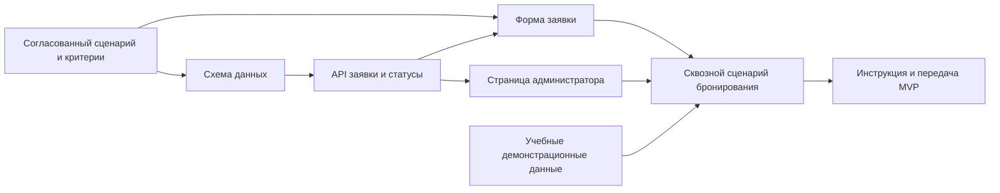

# ЛЗ-5. Карта зависимостей

## Внутренние зависимости

Критическая цепочка для базового MVP: согласованный сценарий → схема данных → API → форма заявки → сквозной сценарий → передача. Если задерживается элемент этой цепочки, сдвигается проверяемая веха соответствующего инкремента.

## Внешние зависимости

| Зависимость | Владелец | Плановая дата подтверждения | Что блокирует | План Б |
| --- | --- | --- | --- | --- |
| Обратная связь по понятности сценария бронирования | Арсен; источник — потенциальный пользователь/представитель локации | 09.10.2026 | Уточнение полей формы и текстов ошибок I1 | Использовать явно помеченные учебные допущения из границ MVP и не делать заявлений о подтверждённом спросе. |
| Доступный Node.js и возможность запустить проект на учебном компьютере | Адильжан; источник — учебная среда/ИТ-служба | 16.10.2026 | Воспроизводимый запуск и серверный сценарий I1 | Подготовить запуск на локальном ноутбуке с зафиксированной версией Node.js; не зависеть от публичного хостинга. |
| Решение о демонстрационном размещении и доступ к облачной БД | Адильжан; источник — владельцы аккаунтов Render/Neon | 06.11.2026 | Публичная демонстрация I3, если она потребуется | Демонстрировать полностью работающий localhost-вариант с SQLite; не переносить реальные данные. |
| Подтверждение критериев сдачи и даты демонстрации | Арсен; источник — преподаватель курса | 13.11.2026 | Финальный объём I3 и формат показа | Следовать методичке ЛЗ-5 и приложить Markdown-документы с проверяемыми критериями. |

За три дня до каждой плановой даты владелец ставит себе напоминание и проверяет статус. Неподтверждённая к сроку зависимость считается риском, фиксируется в статусе команды и активирует указанный план Б.
