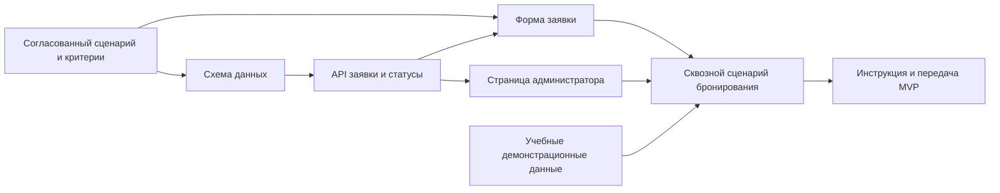

# ЛЗ-5. WBS проекта «Съёмка.kz»

## Принцип декомпозиции

WBS описывает результаты проекта, а не действия. Оценки приведены в командных часах. Сумма пакетов третьего уровня равна оценке родительского элемента; суммарный объём базового MVP — **108 часов**.

```text
1. Базовый MVP «Съёмка.kz» для демонстрации сценария бронирования — 108 ч
   1.1. Подтверждённые границы MVP — 16 ч
       1.1.1. Согласованный пользовательский сценарий «выбор → заявка → обработка» — 8 ч
       1.1.2. Проверяемые критерии приёмки MVP — 8 ч
   1.2. Готовый клиентский интерфейс бронирования — 24 ч
       1.2.1. Отображаемый каталог демонстрационных локаций — 8 ч
       1.2.2. Заполняемая форма заявки с расчётом стоимости — 8 ч
       1.2.3. Доступная страница администратора — 8 ч
   1.3. Рабочий сервер и модель данных — 28 ч
       1.3.1. Схема локаций, заявок и статусов — 8 ч
       1.3.2. API создания и обработки заявки — 12 ч
       1.3.3. Настроенное локальное хранилище и переменные окружения — 8 ч
   1.4. Проверенный сквозной сценарий — 24 ч
       1.4.1. Согласованная связка интерфейса и API — 8 ч
       1.4.2. Проверка пересечений времени и статусов заявки — 8 ч
       1.4.3. Пройденный ручной сценарий демонстрации — 8 ч
   1.5. Подготовленные демонстрационные данные и перенос — 8 ч
       1.5.1. Проверенный набор локаций и заявок для демонстрации — 8 ч
   1.6. Переданный в эксплуатацию учебный MVP — 8 ч
       1.6.1. Инструкция запуска и проведённая передача проекта команде — 8 ч
```

Пакеты 1.5 и 1.6 занимают 16 часов, то есть около 15% объёма. Они включены специально: перенос/подготовка данных и передача проекта обычно теряются в техническом плане, хотя без них демонстрацию нельзя устойчиво повторить.

## Контроль правила 100 процентов

| Элемент | Расчёт | Итог |
| --- | --- | ---: |
| 1.1 | 8 + 8 | 16 ч |
| 1.2 | 8 + 8 + 8 | 24 ч |
| 1.3 | 8 + 12 + 8 | 28 ч |
| 1.4 | 8 + 8 + 8 | 24 ч |
| 1.5 | 8 | 8 ч |
| 1.6 | 8 | 8 ч |
| **1. Базовый MVP** | 16 + 24 + 28 + 24 + 8 + 8 | **108 ч** |

WBS не является календарным графиком: порядок и внешние ожидания показаны в [карте зависимостей](dependencies.md), а сроки — в [плане релизов](release-plan.md).

---

# Полный комплект ЛЗ-5 в одном файле

Ниже собраны все материалы лабораторной работы. Отдельные файлы в папке `docs/plan` сохранены, но для защиты достаточно открыть эту страницу.

## Словарь WBS: пять ключевых пакетов

### 1.2.2. Заполняемая форма заявки с расчётом стоимости — 8 ч

- **Входит:** выбор даты, времени и длительности, контактные поля, расчёт ориентировочной стоимости, отправка заявки в API.
- **Не входит:** онлайн-оплата, SMS и подключение внешних мессенджеров.
- **Результат:** пользователь может заполнить корректную заявку из карточки локации.
- **Критерий готовности (DoD):** обязательные поля проверяются; сумма меняется с длительностью; отправленная заявка получает ссылку на статус; сценарий пройден в браузере.
- **Ответственный:** Арсен (frontend); Адильжан консультирует контракт API.
- **Предшественники:** согласованы поля заявки и ответ API; есть тестовый серверный маршрут.

### 1.3.2. API создания и обработки заявки — 12 ч

- **Входит:** приём заявки, серверная проверка входных данных, проверка пересечения интервалов, статусы и маршруты администратора.
- **Не входит:** реальная обработка платежей и интеграция с внешними CRM.
- **Результат:** API создаёт заявку, возвращает её статус и позволяет администратору менять статус.
- **Критерий готовности (DoD):** API-проверки проходят; две пересекающиеся заявки не принимаются; неавторизованный запрос к административному маршруту отклоняется.
- **Ответственный:** Адильжан (backend и БД).
- **Предшественники:** согласована модель заявки; пароль администратора хранится в переменной окружения.

### 1.3.3. Настроенное локальное хранилище и переменные окружения — 8 ч

- **Входит:** создание локальной SQLite-базы, начальные данные, `.env.example`, безопасные настройки запуска.
- **Не входит:** перенос реальных персональных данных и промышленная отказоустойчивая инфраструктура.
- **Результат:** проект запускается на localhost и сохраняет учебные заявки после перезапуска.
- **Критерий готовности (DoD):** новый разработчик запускает проект по README; секреты не попадают в Git; заявка остаётся после перезапуска сервера.
- **Ответственный:** Адильжан (backend и БД).

### 1.4.2. Проверка пересечений времени и статусов заявки — 8 ч

- **Входит:** проверка занятого интервала на сервере, переходы статусов, ручная проверка конфликтных сценариев.
- **Не входит:** оптимизация под высокую нагрузку и сложное распределение прав пользователей.
- **Результат:** бронирование не создаёт два подтверждённых занятия на один период одной локации.
- **Критерий готовности (DoD):** повторная заявка на занятый интервал получает понятный отказ; статусы `ожидание`, `подтверждена`, `отклонена`, `отменена` совпадают в интерфейсе и API.
- **Ответственный:** Адильжан — серверная логика; Арсен — проверка интерфейса.

### 1.6.1. Инструкция запуска и проведённая передача проекта команде — 8 ч

- **Входит:** README с локальным запуском, перечень переменных, демонстрационный сценарий и совместная проверка запуска.
- **Не входит:** круглосуточная поддержка, обучение внешних студий и коммерческая эксплуатация.
- **Результат:** оба сооснователя воспроизводят демонстрацию без передачи файлов и устных пояснений.
- **Критерий готовности (DoD):** Арсен и Адильжан по очереди запускают чистую копию проекта; демонстрационный сценарий пройден; известные ограничения записаны в документации.
- **Ответственный:** Арсен — инструкция интерфейса и демонстрация; Адильжан — серверные настройки.

## План релизов на семестр

План рассчитан на 12 учебных недель. Дата инкремента сохраняется: если функция не готова, она переносится в следующий этап, а не объявляется готовой без проверки.

| Инкремент | Недели | Цель | Содержание | Веха и проверяемый критерий |
| --- | --- | --- | --- | --- |
| **I1. Сценарий заявки** | 1–4 | Пользователь оформляет тестовую заявку через интерфейс. | Границы MVP, каталог, форма, схема данных, создание заявки. | **«Тестовая заявка создана».** Локация, дата и время отправляются на сервер, пользователь получает ссылку на статус. |
| **I2. Обработка и защита времени** | 5–8 | Администратор видит и обрабатывает заявки; система не допускает конфликтов времени. | Административная страница, статусы, проверка пересечений, интеграционное тестирование. | **«Конфликтное бронирование отклонено».** Повторная заявка на тот же интервал получает отказ, а администратор меняет статус первой. |
| **I3. Повторяемая демонстрация** | 9–12 | Команда запускает и показывает MVP без ручных доработок в день сдачи. | Демонстрационные данные, README, ручной сценарий, передача проекта, резерв на исправления. | **«Демонстрация воспроизводится».** Каждый сооснователь запускает MVP на чистой копии и проходит полный сценарий. |

Первой исключается **онлайн-оплата**: ручное подтверждение заявки уже позволяет проверить основной сценарий бронирования. SMS, мессенджеры, отдельные кабинеты владельцев локаций и подбор съёмочной команды также не входят в учебный MVP.

## Карта зависимостей



Критическая цепочка: согласованный сценарий → схема данных → API → форма заявки → сквозной сценарий → передача.

| Внешняя зависимость | Владелец | Плановая дата подтверждения | Что блокирует | План Б |
| --- | --- | --- | --- | --- |
| Обратная связь по понятности сценария | Арсен; потенциальный пользователь/представитель локации | 09.10.2026 | Уточнение полей формы и текстов ошибок I1 | Использовать учебные допущения и не заявлять о подтверждённом спросе. |
| Доступный Node.js и запуск на учебном компьютере | Адильжан; учебная среда/ИТ-служба | 16.10.2026 | Воспроизводимый запуск I1 | Запускать на локальном ноутбуке с зафиксированной версией Node.js. |
| Решение о размещении и доступ к облачной БД | Адильжан; владельцы аккаунтов Render/Neon | 06.11.2026 | Публичная демонстрация I3 | Показать полностью работающий localhost-вариант с SQLite. |
| Подтверждение критериев сдачи и даты демонстрации | Арсен; преподаватель курса | 13.11.2026 | Финальный объём I3 | Следовать методичке ЛЗ-5 и этому комплекту документов. |

За три дня до плановой даты владелец проверяет статус зависимости. Неподтверждённая вовремя зависимость считается риском и запускает план Б.

## Топология команды и RACI

Арсен и Адильжан образуют одну небольшую **stream-aligned team** вокруг потока «выбор локации → заявка → обработка». Деление на отдельные команды frontend и backend добавило бы лишние согласования для учебного MVP.

| Артефакт | Арсен (frontend) | Адильжан (backend/БД) |
| --- | --- | --- |
| Границы MVP и пользовательский сценарий | **A/R** | C |
| WBS и план релизов | **A/R** | C |
| Контракт API и модель данных | C | **A/R** |
| Форма бронирования и админ-интерфейс | **A/R** | C |
| Проверка конфликтов времени и статусов | C | **A/R** |
| Сквозная ручная проверка | **A** | R |
| Локальный запуск и переменные окружения | I | **A/R** |
| Инструкция, демонстрация и передача проекта | **A/R** | C |

R — выполняет работу, A — единственный отвечающий за итог, C — консультируется, I — информируется. В каждой строке указан ровно один A.

## Реальная capacity команды

| Расчёт | Часы |
| --- | ---: |
| 2 человека × 12 недель × 6 ч в неделю | 144 |
| Минус неделя сессии/учебной пиковой нагрузки | −12 |
| Остаётся до резерва | 132 |
| Минус 15% на координацию, ревью и непредвиденные исправления | −20 |
| **Реальная плановая capacity** | **112 ч** |

Сумма WBS составляет 108 часов. Четыре часа не распределены и остаются резервом на исправление ошибки, очередь работы или уточнение критической зависимости.
