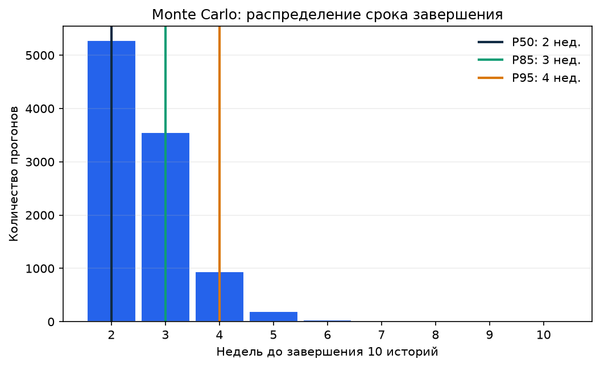
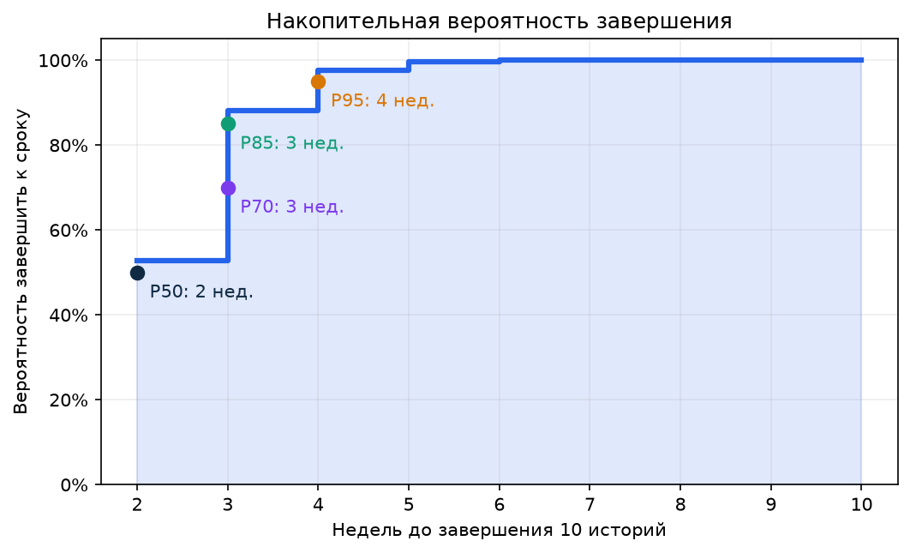

# ЛЗ-6. Ықтималдық мерзім болжамы: Monte Carlo

## Шекара және деректердің шығуы

Болжам Съёмка.kz MVP-дің алғашқы он тарихшасына арналған: US-01–US-10. Командада әлі аяқталған тарихшалардың жеткілікті өз тарихы жоқ, сондықтан throughput-тың 26 бақылаудан тұратын оқу қатары [әдістемеде берілген мысалдан](https://docs.google.com/document/d/1YnEduQa17Q5hHZx4rnQzN4EjeLB51pN_/edit) алынды. Бұл факт ретінде Съёмка.kz-ке телінбейді. Алғашқы екі спринттен кейін осы қатарды өзіміздің GitHub Issues деректерімен ауыстыру қажет.

Симуляция 10 000 рет жүргізілді, кездейсоқ сан генераторының дәні 42-ге бекітілді. Әр прогонда апта сайын өткен throughput қатарынан бір мән алынады; он тарихша аяқталғанша апталар саналады. Сондықтан код қайта орындалғанда дәл сондай нәтиже шығады.

## Нәтиже

| Сенімділік | Мерзім | Егер жұмыс 12.10.2026 басталса, аяқталу күні |
| --- | ---: | --- |
| P50 | 2 недели | 23.10.2026 |
| P70 | 3 недели | 30.10.2026 |
| P85 | 3 недели | 30.10.2026 |
| P95 | 4 недели | 06.11.2026 |

P50 екі аптада аяқтау мүмкін екенін білдіреді, бірақ бұл міндеттеме үшін жеткілікті сенімділік емес. Тапсырыс берушіге P85 ұсынамыз: **3 апта, 30.10.2026 дейін**. P95 төрт аптаға, яғни 06.11.2026 дейін созылуы мүмкін екенін көрсетеді.

## Детерминистік бағамен салыстыру

Команда жоспарлау покерінде он тарихшаға 32 story points берді. Оқу жорамалы бойынша команда аптасына 16 SP орындайды, сондықтан детерминистік жоспар `32 / 16 = 2 апта`. Ол P50 нәтижесімен бірдей. Бұл екі апта ықтимал нұсқа екенін, бірақ тәуекелі бар уәде екенін көрсетеді. P85 үшін бір апта резерв қажет.

## Жоспарлау покері: 10 MVP тарихшасы

| ID | Тарихша | Арсен, SP | Адильжан, SP | Команданың келісімі, SP | Пікірлер неге әртүрлі болды |
| --- | --- | ---: | ---: | ---: | --- |
| US-01 | Каталог локаций | 2 | 3 | **2** | Разница в объёме адаптивной вёрстки и данных каталога. |
| US-02 | Карточка локации | 3 | 5 | **3** | Нужно уточнить число фото и правила показа недоступной локации. |
| US-03 | Свободные интервалы | 5 | 8 | **5** | Неопределённость связана с часовым поясом и закрытыми интервалами. |
| US-04 | Длительность и итоговая цена | 2 | 3 | **2** | Формула простая, но требуется проверка конфликтного времени. |
| US-05 | Заявка на аренду | 5 | 8 | **5** | Разница связана с валидацией и временной блокировкой слота. |
| US-06 | Защита от двойной брони | 5 | 8 | **5** | Нужны серверная атомарность и проверка параллельных запросов. |
| US-07 | Результат отправки | 2 | 3 | **2** | Основной риск — корректная обработка потери ответа сервера. |
| US-08 | Просмотр статуса | 3 | 5 | **3** | Токен и защита персональных данных требуют дополнительной проверки. |
| US-09 | Вход администратора | 3 | 5 | **3** | Оценки различаются из-за ограничений попыток входа и сессии. |
| US-10 | Единый список заявок | 2 | 3 | **2** | Небольшой экран, но нужны фильтры и защита маршрута. |

Барлығы: **32 SP**. Үлкен айырмашылықтар серверлік ережелер, қауіпсіздік және параллель сұраныстар бар тарихшаларда шықты. Арсен интерфейс көлемін, Адильжан деректер тұтастығы мен API тәуекелін бағалады. Келіскеннен кейін команда жоспарлау мәнін таңдады.

## Тапсырыс берушіге арналған хабарлама

> Егер команда 12 қазанда жұмыс бастаса және throughput оқу қатарындағы деңгейге жақын болса, он MVP тарихшасын 30 қазанға дейін аяқтау ықтималдығы шамамен 85%. Екі аптаға аяқтау ықтималы бар, бірақ оны бекітілген мерзім деп уәде етпейміз. Болжамды өзгертуі мүмкін факторлар: жаңа талаптар, броньдау ережелерінің күрделенуі, API/интерфейс интеграциясындағы ақаулар және команданың оқу жүктемесі. Бірінші инкременттен кейін болжамды нақты throughput бойынша қайта есептейміз.

## Болжамның жорамалдары

1. Бэклог көлемі US-01–US-10 тарихшаларымен шектеледі; жаңа функциялар қосылмайды.
2. Тарихшалар көлемі оқу throughput қатарындағы элементтермен салыстырмалы деп алынады.
3. Арсен мен Адильжан аптасына жобаға жоспарланған уақытын бөле алады.
4. Сыртқы төлем, SMS және мессенджерлер интеграциясы бұл болжамға кірмейді.
5. Бұл артефактта әдістемелік оқу қатары қолданылғаны жасырылмайды; нақты командалық дерек жиналғанда ол ауыстырылады.

Қайта орындалатын есеп: [`notebooks/lz6_monte_carlo_forecast.ipynb`](../../notebooks/lz6_monte_carlo_forecast.ipynb).
